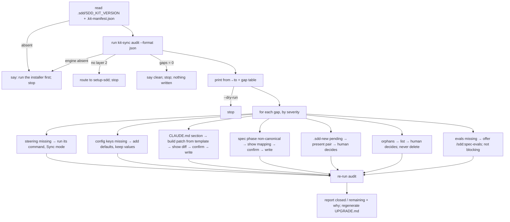

# Design Document — `data-engineer-and-update-sdd` (SDD Kit 0.9.0)

## Overview

**Purpose**: This release gives the executor↔approver loop a real executor — the `data-engineer`
subagent — and gives upgraded projects an incremental path (`/update-sdd`) to bring their project
layer up to the installed engine without redoing the setup.

**Users**: data engineers running `/sdd:spec-impl*` in a project with the kit installed; maintainers
upgrading a project from any earlier kit version.

**Impact**: changes `spec-impl` / `spec-impl-config` (Step 0 and the execution round), the
orchestration-loop rule, the `autoapprove.json` template, `kit-sync.py` (new `audit` subcommand,
`finish` rewired to it), `setup-sdd`, `CLAUDE.md.template`, both installers and `kit-history.json`.
Adds `.claude/agents/data-engineer.md` and `.claude/commands/update-sdd.md`.

### Goals
- A subtask can be executed by a bounded agent with its own context, and judged by someone else.
- Delegation ships off; with it off, 0.9.0 behaves byte-for-byte like 0.8.0 at execution time.
- "What does this project still owe the engine" is computed deterministically, versioned, and is
  the single source for both `UPGRADE.md` and `/update-sdd`.
- `/update-sdd` is additive and idempotent: it never overwrites `CLAUDE.md`, steering, specs or
  existing config values, and running it on a clean project changes nothing.

### Non-Goals
- Other squad roles (analytics engineer, data-quality engineer, platform engineer). Deferred until
  delegated writing is proven end to end.
- Copying the engine (layer 1). That remains the installers' job; `/update-sdd` runs after them.
- Changing `approval-gate.py` semantics or the ledger format.
- Auto-merging `.sdd-new` files or deleting orphans.

## Architecture

### Existing Architecture Analysis
- `spec-impl*` Step 0 reads `.sdd/autoapprove.json` and picks manual vs loop mode; Step 3 is the
  TDD round, performed by the orchestrator. The `approver` agent judges. `approval-gate.py` decides
  by exit code from a ledger. `risk-classification.md` classifies before execution.
- `kit-sync.py`: `preflight` (backup) → installer copies → `finish` (preserve edits, manifest,
  `UPGRADE.md`). `layer2_gaps()` inside `finish` is the seed of the audit.
- `setup-sdd` (skill) bootstraps the project layer as a conversation; it has no notion of "already
  set up".
- Invariants to keep: engine project-agnostic; `high` always human; additions reversible.

### Architecture Pattern & Boundary Map

```mermaid
flowchart LR
  subgraph Orchestrator["Orchestrator (main thread) — /sdd:spec-impl*"]
    S0[Step 0: read autoapprove.json<br/>mode: manual|loop × executor: self|delegated]
    CL[classify risk] --> G[approval-gate.py check]
    G -->|HUMAN| H[human decides]
    G -->|CONTINUE| WO[build Work Order]
  end
  WO -->|Task tool| DE[data-engineer<br/>(write inside scope)]
  DE -->|Work Report| J{loop enabled?}
  J -->|yes| AP[approver (no write)]
  J -->|no| OV[orchestrator verifies criteria]
  AP --> REC[approval-gate.py record]
  OV --> MARK[mark task / phase]
  REC --> MARK
  WG[write-guard hook<br/>PreToolUse] -.applies to.-> DE
  WG -.applies to.-> Orchestrator
```

```mermaid
flowchart LR
  INST[install.sh / install.ps1] --> PF[kit-sync preflight] --> COPY[copy layer 1] --> FIN[kit-sync finish]
  FIN --> AUD[kit-sync audit<br/>(versioned checks, read-only)]
  AUD --> UPG[.sdd/UPGRADE.md]
  U[/update-sdd] --> AUD
  U --> ACT[close gaps: steering cmds (Sync), config keys, CLAUDE.md section patch, phase mapping]
  ACT --> AUD2[re-audit] --> UPG
  SET[setup-sdd] -->|layer 2 exists| U
  U -->|layer 2 absent| SET
```

**Architecture Integration**:
- Selected pattern: *config-gated delegation inside existing commands* + *deterministic audit as
  the contract between installer, report and update command*.
- Boundaries: orchestrator decides and records; `data-engineer` writes within a work order;
  `approver` judges; `kit-sync audit` computes; `/update-sdd` acts on the audit only.
- Existing patterns preserved: Step 0 "read the config, don't ask"; gate by exit code; ledger as
  proof; installer never overwrites `CLAUDE.md`; `.sdd-new` sidecar for conflicts.
- Steering compliance: engine stays generic (no project names in any new file).

### Technology Stack

| Layer | Choice / Version | Role in Feature | Notes |
|-------|------------------|-----------------|-------|
| Agent prompts | Markdown with YAML frontmatter (Claude Code agents/commands) | `data-engineer.md`, `update-sdd.md`, edits to `spec-impl*.md`, `setup-sdd/SKILL.md` | English (engine language) |
| Rules/templates | Markdown / JSON under `.sdd/settings/` | `orchestration-loop.md`, `autoapprove.json`, `CLAUDE.md.template` | JSON templates keep `_comment` keys |
| Tools | Python 3.7+ stdlib | `kit-sync.py audit` | ASCII-safe console output (cp1252) |
| Installers | bash + Windows PowerShell 5.1 (ASCII, no BOM) | `$required` / required list, next-steps text | both kept in sync |

## System Flows

### Delegated round (loop enabled)

```mermaid
sequenceDiagram
  participant O as Orchestrator
  participant G as approval-gate.py
  participant E as data-engineer
  participant A as approver
  O->>O: classify subtask (risk + worst action)
  O->>G: check --risk <level>
  G-->>O: exit 0 CONTINUE
  O->>E: Work Order (id, req IDs, exit criteria, risk, write scope, design pointers)
  E->>E: read steering, design, write-scope; TDD; write inside scope
  E-->>O: Work Report (files, commands+results, evidence, criteria met/not, out-of-scope, env note)
  O->>A: Work Report + exit criteria
  A-->>O: APPROVE | REJECT(feedback) | ESCALATE
  O->>G: record role=approver executor=data-engineer decision=...
  alt APPROVE
    O->>O: mark task, phase, evidence/
  else REJECT
    O->>E: Work Order + feedback (next round, gate checked again)
  else ESCALATE
    O->>O: hand to human
  end
```

Flow decisions: the gate is checked *before* each delegated round exactly as before; `high`
returns `HUMAN` from the gate, and only after the human approves is the Work Order sent (Req 1.4).
With the loop disabled, the approver step is replaced by the orchestrator checking the report's
criteria itself (Req 1.10) and there is no ledger — same as 0.8.0 manual mode.

### `/update-sdd`



## Requirements Traceability

| Requirement | Summary | Components | Interfaces | Flows |
|-------------|---------|------------|------------|-------|
| 1.1, 1.3, 2.1, 2.3, 2.4 | delegation off → 0.8.0 behavior; mode line; missing agent fallback | ImplStep0, DelegationConfig | `delegation` block | Delegated round |
| 1.2, 1.5, 1.6, 1.7, 1.8, 1.12 | Work Order / Work Report contract, executor bounds | DataEngineerAgent, LoopRule | Work Order, Work Report | Delegated round |
| 1.4 | high executed via delegated path after human | ImplStep0, LoopRule | — | Delegated round |
| 1.9, 1.10 | approver vs orchestrator verification | ImplRound, LoopRule | ledger `record` note | Delegated round |
| 1.11 | investigation profile never delegates | ImplStep0 (investigation) | — | — |
| 2.2, 2.5 | single config, installer never overwrites | DelegationConfig, Installers | `autoapprove.json` | — |
| 3.1, 3.2 | template routing line, setup-sdd offer | ClaudeTemplate, SetupSkill | — | — |
| 3.3, 3.4 | write-guard applies to subagent; convention elsewhere | DataEngineerAgent, WriteGuardProof | hook stdin JSON | — |
| 4.1–4.7 | versioned, read-only, JSON+human audit | KitSyncAudit | `audit` CLI | `/update-sdd` |
| 5.1–5.15 | incremental update behavior | UpdateCommand, KitSyncAudit | `audit --format json` | `/update-sdd` |
| 5.16, 5.17 | routing between setup-sdd, update-sdd, installer, report | SetupSkill, Installers, KitSyncReport | — | — |
| 6.1–6.5 | release integrity | Installers, KitHistory, ReleaseDocs | `$required`, `kit-history.json` | — |

## Components and Interfaces

| Component | Domain/Layer | Intent | Req Coverage | Key Dependencies | Contracts |
|-----------|--------------|--------|--------------|------------------|-----------|
| DataEngineerAgent | `.claude/agents/data-engineer.md` (new) | bounded executor of one Work Order | 1.5–1.8, 1.12, 3.4 | steering, design.md, write-scope.json (P0) | Work Order in / Work Report out |
| LoopRule | `.sdd/settings/rules/orchestration-loop.md` | define executor = self or delegated; fix the two contracts | 1.2, 1.4, 1.9, 1.10 | risk-classification (P0) | Work Order, Work Report |
| ImplStep0 / ImplRound | `spec-impl.md`, `spec-impl-config.md` (edit); `spec-impl-investigation.md` (one-line exclusion) | read delegation config, print mode, run delegated round | 1.1–1.4, 1.9–1.11, 2.3, 2.4 | LoopRule, approval-gate (P0) | Task tool call to `data-engineer` |
| DelegationConfig | `.sdd/settings/templates/autoapprove.json` | ship `delegation` block off | 2.1, 2.2, 2.5 | installers (copy-if-missing already) | JSON schema below |
| ClaudeTemplate | `CLAUDE.md.template` | routing line + quick-ref row + one sentence in auto-approval section | 3.1, 5.17 | — | template headings = section identity for the audit |
| SetupSkill | `.claude/skills/setup-sdd/SKILL.md` | step 0 hand-off when layer 2 exists; step 4 delegation offer | 3.2, 5.16 | KitSyncAudit | — |
| KitSyncAudit | `tools/kit-sync.py` `audit` (new) + `finish` rewired | versioned, read-only gap computation; JSON + human | 4.1–4.7, 5.13, 5.17 | manifest, kit-history, template | CLI below |
| KitSyncReport | `tools/kit-sync.py` `write_report` | `UPGRADE.md` from audit; next-step routing | 4.3, 5.17 | KitSyncAudit | — |
| UpdateCommand | `.claude/commands/update-sdd.md` (new) | act on the audit, additively, gated | 5.1–5.15 | KitSyncAudit, steering commands, template | `--dry-run` |
| Installers | `install.sh`, `install.ps1` | required list, next-steps text | 5.17, 6.1, 6.3 | — | — |
| KitHistory | `.sdd/settings/kit-history.json` | 0.9.0 path list | 6.2 | — | — |
| WriteGuardProof | evidence file under the spec | prove hook fires for subagent Bash | 3.3 | write-guard.py | `evidence/write-guard-subagent-<date>.md` |
| ReleaseDocs | VERSION, CHANGELOG, README, HANDOFF, fluxo-visual | release checklist | 6.3, 6.4, 6.5 | — | — |

### Execution layer

#### DataEngineerAgent

| Field | Detail |
|-------|--------|
| Intent | Execute exactly one Work Order inside declared bounds and return a Work Report |
| Requirements | 1.5, 1.6, 1.7, 1.8, 1.12, 3.4 |

**Responsibilities & Constraints**
- Frontmatter: `name: data-engineer`, `tools: Read, Write, Edit, MultiEdit, Grep, Glob, Bash`.
  Description says: "Executor for implementation subtasks when delegation is enabled in
  `.sdd/autoapprove.json`. Invoked by `/sdd:spec-impl` and `/sdd:spec-impl-config` with a Work
  Order. Writes only inside the write scope and the permitted paths; never marks tasks, never
  approves."
- Reads, in order: `.sdd/steering/*` (all), `.sdd/specs/<feature>/design.md` (sections named in
  the Work Order), `.sdd/write-scope.json`, `.sdd/steering/integrations.md` → Data platform row
  for any query, `semantic-layer.md` if present.
- TDD inside the round (test → minimal code → refactor → verify), same discipline as `spec-impl`
  Step 3. For `spec-impl-config` Work Orders, the round is "dry-run validation" as that profile
  already defines.
- Hard stops (report, do not act): action riskier than declared; write outside scope/paths;
  a metric with no contract; a required credential; anything destructive.
- Never edits `tasks.md`, `spec.json`, `approval-log.jsonl`, or any file outside the Work Order's
  permitted paths. Never calls the approver. Never spawns work of its own.
- Environment note: if no hook can run where it is (hosted notebook), it says so in the report
  (Req 3.4) — the phrase is fixed so the orchestrator and `report-validator` can find it.

**Contracts**: State [x] (Work Order → Work Report)

##### Work Order (sent by the orchestrator, verbatim shape)
```markdown
## Work Order — <feature> / task <N.M>
- **Requirements:** 2.1, 2.3
- **Risk:** medium — <worst action, one line>
- **Exit criteria (pass/fail):**
  1. <criterion> — verify by: <command / check>
  2. ...
- **Write scope:** <catalog.schema list from write-scope.json, or "n/a — no data platform">
- **Permitted paths:** <globs the subtask may create/edit>
- **Design pointers:** design.md → <section names / component names>
- **Profile:** spec-impl | spec-impl-config
- **Feedback from previous round:** <none | approver text>
```

##### Work Report (returned by the agent, verbatim shape)
```markdown
## Work Report — <feature> / task <N.M> — round <k>
- **Files changed:** path:lines (created | edited)
- **Commands run:** `<cmd>` → <result, one line each>
- **Evidence written:** .sdd/specs/<feature>/evidence/<what>-<date>.md (or none)
- **Exit criteria:**
  1. met — <evidence>
  2. NOT met — <why>
- **Out of scope, observed:** <list or none>
- **Stopped early:** no | yes — <reason: higher risk than declared / outside write scope / undefined metric / credential needed>
- **Environment:** hooks available | hooks not available here — write scope applied as convention
```

#### LoopRule (orchestration-loop.md)
- "Roles" section gains: *Executor is the orchestrator itself, or the agent named in
  `delegation.executor` when `delegation.enabled` and the subtask's level is enabled.* The two
  contracts above are defined here once; the agent prompt mirrors them.
- Loop diagram step 1 becomes "executor (self or delegated) produces Work Report"; the `record`
  note carries `executor=<self|data-engineer>`.
- New paragraph "Delegation and the gate": the gate is checked before every round regardless of
  who executes; `high` → `HUMAN`; after a human YES the Work Order is sent if `delegation.high`.
- Fallback section: `delegation` absent/invalid/`enabled:false` → executor is self; identical to 0.8.0.

#### ImplStep0 / ImplRound (`spec-impl.md`, `spec-impl-config.md`)
- Step 0 reads both blocks. Mode line format (one line, before anything):
  `mode: manual|loop · executor: self|data-engineer(low:no medium:yes high:yes)`.
- If `delegation.enabled` and `.claude/agents/<executor>.md` is missing → print
  "executor <name> not installed — executing inline" and treat as self (Req 2.4).
- Step 3: "If the subtask is delegated, do not perform the TDD cycle yourself: build the Work
  Order from the classification + `design.md`, call the `<executor>` subagent (Task tool), and
  treat its Work Report as the round result. With the loop on, hand the report to `approver`;
  with the loop off, check each exit criterion against the report's evidence yourself before
  marking." Marking, phase, `evidence/` remain the orchestrator's (Req 1.6).
- `spec-impl-investigation.md`: one sentence in Step 0 — "This profile never delegates to
  `data-engineer`; data access stays with `data-analyst` (read-only)."
- `spec-impl-auto.md` and `spec-quick.md` inherit through `spec-impl` (no edit beyond a mention).

#### DelegationConfig (`autoapprove.json` template)
```json
"delegation": {
  "enabled": false,
  "executor": "data-engineer",
  "low": false,
  "medium": true,
  "high": true,
  "_note": "Who TYPES a subtask, never who APPROVES it. enabled=false (default) = the orchestrator executes, exactly as 0.8.0. Per-level flags say which risk levels are handed to the executor agent; 'high' here means 'after the human approved it'. The gate still forces HUMAN for high regardless of this block."
}
```
- Preconditions: file parses; missing block → treated as `enabled: false`.
- Invariant: nothing in this block is read by `approval-gate.py`; the gate's contract is unchanged.

### Upgrade layer

#### KitSyncAudit (`tools/kit-sync.py audit`)

| Field | Detail |
|-------|--------|
| Intent | Compute, read-only and deterministically, what the project layer owes the installed engine |
| Requirements | 4.1–4.7, 5.13, 5.17 |

**CLI contract**
```
python tools/kit-sync.py audit --target <dir> [--kit <dir>] [--format human|json]
exit 0 = no gaps · 1 = gaps found · 2 = engine absent / internal error
```
- `--kit` optional: when given, the template and `kit-history.json` are read from the kit; when
  absent (run from inside an installed project), they are read from the target's own
  `.sdd/settings/` and `CLAUDE.md.template` (present since the installer copies it alongside).
- Engine absent = no `.sdd/SDD_KIT_VERSION` **and** no `.sdd/settings/rules/` → exit 2 with one
  line (Req 4.7).
- Layer 2 absent = no `CLAUDE.md` and empty `.sdd/steering/` → JSON `"layer2": "absent"` so the
  command can route to `setup-sdd` (Req 5.15).

**Check table** — one Python list `CHECKS`, each entry `(id, since_version, severity, what, closes_with, why, predicate)`. Predicates are pure functions of the target's disk. Initial contents:

| id | since | severity | what | closes with |
|---|---|---|---|---|
| `steering.product` / `.tech` / `.structure` | 0.1.0 | blocking | core steering file missing | `/sdd:steering` |
| `steering.integrations` | 0.2.0 | blocking | `integrations.md` missing | `/sdd:discover-tools` |
| `steering.inherited` | 0.2.0 | recommended | `inherited-knowledge.md` missing | `/sdd:absorb-knowledge` |
| `claude.missing` | 0.1.0 | blocking | no `CLAUDE.md` | `setup-sdd` |
| `claude.placeholders` | 0.1.0 | blocking | `{{` still present | `/update-sdd` (section patch) |
| `claude.phase-gates` | 0.5.0 | blocking | "approval gate at each phase" | `/update-sdd` |
| `claude.convention-not-lock` | 0.8.0 | recommended | "gate is convention, not a lock" | `/update-sdd` |
| `claude.spec-impl-auto` | 0.8.0 | recommended | tells to use `/sdd:spec-impl-auto` w/o 0.8 mention | `/update-sdd` |
| `claude.section.<slug>` | per section | recommended | a template `## ` heading absent from the project file (Routing, Auto-approval mode, Quality gate, Quick reference, Where you are running is *optional* → skipped) | `/update-sdd` |
| `claude.routing.<agent>` | version the agent shipped | recommended | agent installed in `.claude/agents/` but not mentioned in `CLAUDE.md` | `/update-sdd` |
| `config.autoapprove.missing` | 0.4.0 | recommended | `.sdd/autoapprove.json` absent | `/update-sdd` (copy template) |
| `config.autoapprove.key.<path>` | 0.4.0 / 0.9.0 | recommended | a top-level key of the template absent (e.g. `delegation`) | `/update-sdd` (add key, keep values) |
| `config.write-scope.missing` | 0.8.0 | recommended | `.sdd/write-scope.json` absent | `/update-sdd` |
| `config.vscode.missing` | 0.7.0 | optional | `.vscode/tasks.json` absent | `/update-sdd` |
| `engine.sdd-new` | 0.7.0 | recommended | any `*.sdd-new` in engine trees | `/update-sdd` (human decides) |
| `engine.orphan` | 0.7.0 | optional | file in previous manifest, absent from kit, present on disk | `/update-sdd` (human decides) |
| `spec.<name>.evals` | 0.6.0 | optional | `requirements.md` without `evals.md` | `/sdd:spec-evals <name>` |
| `spec.<name>.phase` | 0.8.0 | recommended | `spec.json.phase` not canonical | `/update-sdd` (mapping shown) |

- Section identity for `claude.section.*`: the template's `## ` headings, compared after
  lower-casing and stripping punctuation; a project heading that contains the template heading's
  first two words counts as present (tolerates "Routing — who does the work" vs "Routing").
- Routing checks derive the agent list from the installed `.claude/agents/*.md` frontmatter
  `name:`; presence = the name appears in `CLAUDE.md`. Project-agnostic by construction (Req 4.5).
- **JSON output**: `{ "kit_version", "previous_version", "layer2": "present|absent",
  "gaps": [ {id, since, severity, what, closes_with, why, path} ] }`. Human output: the same
  table that `UPGRADE.md` prints today, grouped by severity, with a "new since <previous_version>"
  marker when `since > previous_version`.
- `finish` calls `audit` internally and passes the result to `write_report` (Req 4.3). The old
  `layer2_gaps()` is removed, not kept beside it.
- Read-only: the function takes paths, returns data; the only writer remains `write_report`.

#### KitSyncReport (`write_report`)
- Table generated from the audit rows (severity column added).
- "Próximo passo": `previous_version` known and layer 2 present → "run `/update-sdd` inside the
  project: it closes only the rows above, without redoing the setup"; first install or layer 2
  absent → `setup-sdd` (Req 5.17).

#### UpdateCommand (`.claude/commands/update-sdd.md`)

| Field | Detail |
|-------|--------|
| Intent | Close the audit's gaps additively, one at a time, with the human at every irreversible or behavior-changing edit |
| Requirements | 5.1–5.15 |

- Frontmatter: `description: Bring the project layer up to the installed SDD Kit version — closes only what the upgrade audit found, never redoes the setup`; `allowed-tools: Bash, Read, Write, Edit, Glob, Grep`; `argument-hint: [--dry-run]`.
- Step 1 — precondition: read `.sdd/SDD_KIT_VERSION`; missing → "run the installer first" and stop (Req 5.2).
- Step 2 — audit: `py tools/kit-sync.py audit --target . --format json` (`python3` fallback). Exit
  2 → stop with the message. `layer2: absent` → route to `setup-sdd` and stop (Req 5.15). Zero gaps
  → "clean for <version>", stop (Req 5.3).
- Step 3 — plan: print from→to and the gap table grouped by severity. `--dry-run` → stop (Req 5.12).
- Step 4 — act, in severity order, one gap per turn, each with its own rule (Req 5.4):
  - `steering.*` → invoke the command named in `closes_with`; `/sdd:steering` runs in Sync mode
    by construction when core files exist; never re-generate an existing file.
  - `config.*.missing` → copy the template. `config.*.key.*` → read both JSONs, add only absent
    top-level keys (and absent keys inside `delegation`/`limits`), write back with the original
    key order preserved for existing keys; show the added keys (Req 5.5).
  - `claude.section.*` / `claude.routing.*` / `claude.phase-gates` / `claude.convention-not-lock`
    / `claude.spec-impl-auto` / `claude.placeholders` → **section patch protocol**: extract the
    matching section from `CLAUDE.md.template`; for a missing section, insert it before the
    template's next heading that the project has (or append); for a stale phrase, replace only
    the sentence carrying the marker; for placeholders, list them and ask for values. Show the
    unified diff, wait for confirmation, then apply with a single edit (Req 5.6, 5.7). If the
    project renamed the heading, ask instead of inserting a duplicate.
  - `spec.<name>.phase` → propose the mapping (`implementado` → `implementation-complete`, etc.,
    derived from `tasks.md` checkbox state when ambiguous), confirm, then edit `spec.json` (Req 5.10).
  - `engine.sdd-new` → show a short diff summary of `<file>` vs `<file>.sdd-new`, ask keep / take
    kit's / merge by hand; never decide (Req 5.8).
  - `engine.orphan` → list; say deletion is the human's; do nothing (Req 5.9).
  - `spec.<name>.evals` → offer `/sdd:spec-evals <name>`; not blocking (Req 5.11).
- Step 5 — re-audit; print closed / remaining with reasons; run
  `kit-sync.py audit --target . --format human > .sdd/UPGRADE.md`? No — `UPGRADE.md` is written by
  `write_report`; expose it as `kit-sync.py report --target .` (thin wrapper around audit +
  write_report, no manifest change) and call that (Req 5.13).
- Never asks intake questions; every input it needs is on disk or in the gap row (Req 5.14).
- Risk posture inside the command: config-key additions and steering generation are `medium`
  (new, non-destructive) and run without asking; every `CLAUDE.md` edit and every phase change
  waits for confirmation because it changes agent behavior; deletions are never performed.

#### SetupSkill
- New step **0.5 — "Is this an upgrade?"**: if `CLAUDE.md` exists without `{{` and
  `.sdd/steering/product.md` exists → "This project already has its layer 2. Run `/update-sdd`;
  it closes only what the upgrade audit found. Continue with setup only if you want to start
  over." and stop (Req 5.16).
- Step 4 gains a bullet **Delegated executor** with the recommended posture (`enabled: true`,
  `medium`+`high`, `low` inline) and the sentence "enabling it changes who types, never who
  approves; the proof it ran is `executor=data-engineer` in `approval-log.jsonl`" (Req 3.2).

#### ClaudeTemplate
- Routing: `- **Implementation subtasks (when delegation is on in \`.sdd/autoapprove.json\`)** →
  the \`data-engineer\` subagent executes each Work Order inside the write scope and returns a
  Work Report; the orchestrator (or the approver) judges it. Inert while delegation is off.`
- Auto-approval section: one sentence — "`delegation` in the same file decides who executes
  (orchestrator or `data-engineer`); it never changes who approves."
- Quick reference: `| \`/update-sdd [--dry-run]\` | after upgrading the engine: close only what
  the project layer owes the new version |`.

#### Installers / KitHistory / ReleaseDocs
- `$required` (ps1) and the bash equivalent add `.claude/agents/data-engineer.md` and
  `.claude/commands/update-sdd.md` (Req 6.1).
- Next-steps text: line 1 becomes "upgrade? run `/update-sdd` · first install? run `setup-sdd`".
- `kit-history.json` gains `"0.9.0"` = 0.8.0 list + the two new files (Req 6.2).
- Release checklist from the workbench `CLAUDE.md` (VERSION, CHANGELOG, README, HANDOFF,
  fluxo-visual, grep, zip, tag) (Req 6.3–6.5).

## Data Models

### Configuration (`.sdd/autoapprove.json`) — added block
See DelegationConfig above. Top-level keys after 0.9.0: `_comment`, `auto_approve`, `limits`,
`delegation`. The audit treats any top-level key of the template absent from the project file as
`config.autoapprove.key.<name>`.

### Audit result (JSON)
```json
{
  "kit_version": "sdd-kit 0.9.0",
  "previous_version": "sdd-kit 0.7.0",
  "layer2": "present",
  "gaps": [
    {"id": "claude.phase-gates", "since": "0.5.0", "severity": "blocking",
     "what": "CLAUDE.md describes a gate per PHASE", "closes_with": "/update-sdd",
     "why": "pre-0.5.0 posture; risk-based autonomy is not active", "path": "CLAUDE.md"}
  ]
}
```
Severity order: `blocking` < `recommended` < `optional`. `since` is semver text compared numerically.

## Error Handling

| Situation | Behavior |
|---|---|
| `autoapprove.json` unparsable | both blocks treated as disabled; Step 0 says "config invalid → manual, self" |
| executor agent file missing | inline execution + one-line notice (Req 2.4) |
| `data-engineer` stops early | Work Report `Stopped early: yes`; orchestrator records `ESCALATE`-like note and hands to human; never retries silently |
| Python missing for the audit | `/update-sdd` says the audit cannot run and stops (no model-side guessing) |
| audit exit 2 | message from the tool is shown verbatim; command stops |
| `CLAUDE.md` heading renamed | command asks; never inserts a duplicate section |
| `.sdd-new` / orphans | always human |

## Testing Strategy

- **Unit (kit-sync audit)**: three fixture targets built in a temp dir — (a) fresh, engine only
  (expect `layer2: absent`); (b) "0.1.0-style" layer 2: `CLAUDE.md` with phase-gate text, only
  three steering files, `autoapprove.json` without `delegation`, one spec with phase `implementado`
  and no `evals.md` (expect the exact gap ids); (c) complete 0.9.0 layer 2 (expect exit 0, empty
  `gaps`). Run twice: identical output (determinism). Assert no file mtime changed (read-only).
- **Unit (config merge)**: `autoapprove.json` from 0.4.0 + template → only `delegation` added,
  original values and key order intact.
- **Integration (installer)**: `install.ps1` and `install.sh` into a temp target twice; second run
  shows no preserved edits, `UPGRADE.md` "Próximo passo" says `/update-sdd`; `$required` fails
  early when `data-engineer.md` is renamed away.
- **Integration (delegated round)**: with `delegation.enabled: true` and the loop **off**, run
  `/sdd:spec-impl` on a one-task spec in a scratch project; expect a Work Order/Work Report pair
  in the transcript, task marked by the orchestrator, no `approval-log.jsonl`. Repeat with the loop
  **on**: ledger rows carry `executor=data-engineer`.
- **Guardrail proof**: `write-scope.json` enabled with a fake allowed target; a Work Order whose
  only path is an `INSERT` outside scope → the hook denies inside the subagent; evidence file
  written with the hook's JSON output (Req 3.3).
- **E2E on the test-bed**: copy `workspace_export/` to a scratch dir, run `install.ps1`, then
  `/update-sdd --dry-run`: expect the four rows the current `UPGRADE.md` lists plus
  `claude.routing.*`, `config.autoapprove.key.delegation`, `claude.section.*` rows; then run for
  real and confirm `CLAUDE.md` diff was shown before each write and steering hashes for existing
  files are unchanged.
- **Traceability**: `py tools/spec-lint.py data-engineer-and-update-sdd` clean.

## Security Considerations
- The delegated executor has write tools; its bounds are: the Work Order's permitted paths
  (convention), the write-scope hook (deterministic where hooks run), and the approver/orchestrator
  review before any task is marked. Nothing in this release grants it credentials, network
  access it did not have, or the ability to approve.
- `/update-sdd` performs no deletion and no whole-file overwrite; every behavior-changing edit to
  `CLAUDE.md` is diff-confirmed.

## Migration Strategy
- No data migration. Existing projects: install 0.9.0 → `UPGRADE.md` lists
  `config.autoapprove.key.delegation` → `/update-sdd` adds the block **off**. Behavior unchanged
  until a human edits it.

## Supporting References
- `research.md` — option evaluation and the open question on hooks in subagents.
- `.sdd/settings/rules/orchestration-loop.md`, `risk-classification.md`, `spec-artifacts.md`.
